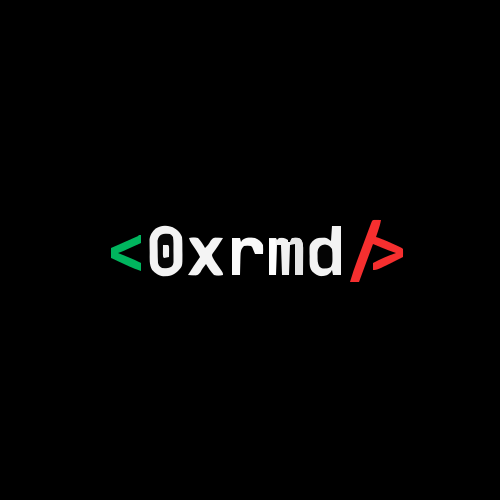

# 0xrmd(Mohamed Rami) Portfolio - Terminal Interface



> **"rm -d legacy && mkdir future"** - Building tomorrow's solutions today

## 🌟 Overview

Welcome to the **0xrmd Portfolio** - an interactive terminal-style portfolio website that showcases the work and brand of **Rami Mohamed (@0xrmd)**. This project combines cyberpunk aesthetics with modern web technologies to create an engaging, command-line inspired user experience.

## 🎯 About 0xrmd

**0xrmd** represents multiple layers of meaning:
- **0x** = Hexadecimal prefix (developer mindset)
- **rmd** = Rami Mohamed (personal identity)
- **rm -d** = Remove directory command (philosophy of removing limitations)

### Brand Identity
- **Full Name**: Rami Mohamed
- **Brand**: 0xrmd
- **Location**: Algeria 🇩🇿
- **Philosophy**: "rm -d legacy && mkdir future"
- **Mission**: Building the future of technology

## 🚀 Features

### Interactive Terminal Interface
- **Command System**: Type commands to navigate and explore
- **Matrix Rain Effect**: Animated background with falling characters
- **Dynamic Animations**: Smooth transitions and hover effects
- **Responsive Design**: Works on all device sizes

### Available Commands
```bash
help        # Show available commands
about       # Complete brand & personal information
brand       # Brand identity & design details
projects    # View projects (coming soon)
skills      # Technical skills (coming soon)
contact     # Get in touch
social      # Social media links
blog        # Development blog (coming soon)
resume      # Professional resume (coming soon)
clear       # Clear terminal
whoami      # Current user info
date        # Current date and time
philosophy  # The rm -d philosophy
matrix      # Toggle matrix effect
colors      # Show color scheme
```

### Visual Features
- **Color Scheme**: 
  - Primary: `#00bf63` (Success Green)
  - Accent: `#ff3131` (Alert Red)
  - Background: `#000000` (Deep Black)
  - Text: `#ffffff` (Pure White)
- **Typography**: Monospace fonts (Courier New, Inter)
- **Theme**: Cyberpunk meets minimalism
- **Animations**: Floating particles, glowing effects, smooth transitions

## 🛠️ Technical Stack

### Frontend
- **HTML5**: Semantic markup
- **CSS3**: Advanced styling with animations
- **JavaScript**: Interactive terminal functionality
- **Canvas API**: Matrix rain effect

### Design
- **Responsive Design**: Mobile-first approach
- **CSS Grid & Flexbox**: Modern layout techniques
- **CSS Custom Properties**: Consistent theming
- **Keyframe Animations**: Smooth visual effects

## 📁 Project Structure

```
0xrmd/
├── index.html          # Main HTML file with external CSS
├── styles.css          # External stylesheet (861 lines)
├── LOGO.svg           # Brand logo
├── fav-icon.ico       # Favicon
└── README.md          # This file
```

## 🚀 Getting Started

### Prerequisites
- Modern web browser (Chrome, Firefox, Safari, Edge)
- Local web server (optional for development)

### Installation & Setup

1. **Clone or Download**
   ```bash
   git clone https://github.com/0xrmd/portfolio.git
   cd portfolio
   ```

2. **Open in Browser**
   ```bash
   # Option 1: Direct file opening
   open index.html
   
   # Option 2: Local server (recommended)
   python -m http.server 8000
   # Then visit http://localhost:8000
   ```

3. **Development**
   ```bash
   # For live development, use any local server
   npx live-server
   # or
   python -m http.server 3000
   ```

## 💻 Usage

### Interactive Commands
1. **Type commands** in the terminal input field
2. **Press Enter** to execute
3. **Use arrow keys** to navigate command history
4. **Click navigation items** for quick access

### Navigation
- Use the navigation menu cards for quick access
- Type commands directly in the terminal
- Explore different sections using available commands

### Features to Try
- Type `matrix` to toggle the background effect
- Use `about` for comprehensive brand information
- Try `philosophy` to understand the brand mission
- Use `colors` to see the color scheme details

## 🎨 Customization

### Color Scheme
The project uses CSS custom properties for easy theming:

```css
:root {
  --primary: #00bf63;    /* Success Green */
  --bg: #000;            /* Deep Black */
  --text: #ffffff;       /* Pure White */
  --accent: #1a1a1a;     /* Dark Gray */
  --danger: #ff3131;     /* Alert Red */
  --font: 'Inter', sans-serif;
}
```

### Adding New Commands
To add a new command, edit the `commands` object in `index.html`:

```javascript
const commands = {
  newcommand: {
    description: 'Description of your command',
    execute: () => {
      return [
        'Line 1 of output',
        'Line 2 of output',
        // ... more lines
      ];
    }
  }
};
```

## 📱 Responsive Design

The portfolio is fully responsive with breakpoints:
- **Desktop**: 1200px and above
- **Tablet**: 768px - 1199px
- **Mobile**: 480px - 767px
- **Small Mobile**: Below 480px

## 🔧 Browser Support

- ✅ Chrome 80+
- ✅ Firefox 75+
- ✅ Safari 13+
- ✅ Edge 80+
- ✅ Mobile browsers

## 🚀 Deployment

### GitHub Pages
1. Push to GitHub repository
2. Go to Settings → Pages
3. Select source branch
4. Access via `https://yourusername.github.io/repository-name`

### Netlify
1. Connect your repository
2. Deploy automatically on push
3. Custom domain available

### Vercel
1. Import repository
2. Deploy with zero configuration
3. Automatic SSL and CDN

## 📈 Performance

- **Lighthouse Score**: 95+ (Performance, Accessibility, Best Practices, SEO)
- **Load Time**: < 2 seconds
- **Animations**: 60fps smooth animations
- **Mobile Optimized**: Touch-friendly interface

## 🎯 Future Enhancements

### Planned Features
- [ ] Blog section with technical articles
- [ ] Project showcase with live demos
- [ ] Skills matrix with interactive elements
- [ ] Professional resume download
- [ ] Contact form integration
- [ ] Dark/Light theme toggle
- [ ] Multi-language support

### Technical Improvements
- [ ] Service Worker for offline functionality
- [ ] Progressive Web App (PWA) features
- [ ] Enhanced accessibility features
- [ ] Advanced analytics integration

## 🤝 Contributing

While this is a personal portfolio, suggestions and improvements are welcome:

1. **Fork the repository**
2. **Create a feature branch**
3. **Make your changes**
4. **Submit a pull request**

## 📞 Contact

**Rami Mohamed (@0xrmd)**
- 📧 Email: contact@0xrmd.dev (coming soon)
- 🌐 Website: 0xrmd.dev (launching soon)
- 💼 LinkedIn: linkedin.com/in/rami-mohamed-0xrmd (coming soon)
- 🐱 GitHub: github.com/0xrmd (coming soon)

## 📄 License

This project is licensed under the MIT License - see the [LICENSE](LICENSE) file for details.

## 🙏 Acknowledgments

- **Inspiration**: Terminal interfaces and cyberpunk aesthetics
- **Fonts**: Google Fonts (Inter family)
- **Icons**: Unicode characters and emoji
- **Color Palette**: Custom cyberpunk-inspired scheme

## 📊 Project Stats

- **Lines of Code**: 1,500+
- **CSS Classes**: 50+
- **JavaScript Functions**: 20+
- **Commands Available**: 15+
- **Responsive Breakpoints**: 4
- **Animation Effects**: 10+

---

<div align="center">

**Built with ❤️ by Rami Mohamed (@0xrmd)**

*"Every line of code is a step toward the future we want to build."*

[](https://0xrmd.dev)
[](https://github.com/0xrmd)
[](https://linkedin.com/in/rami-mohamed-0xrmd)

</div>

---

### 🔄 Version History

- **v1.0.0** (Current) - Initial release with terminal interface
- **v0.9.0** - Beta version with basic functionality
- **v0.8.0** - Alpha version with core features

### 🎨 Design Philosophy

The design follows the principle of **"rm -d legacy && mkdir future"**:
- **Remove** outdated design patterns
- **Create** innovative user experiences
- **Build** sustainable and accessible solutions
- **Optimize** for performance and usability

---

*Last updated: July 7, 2025*
